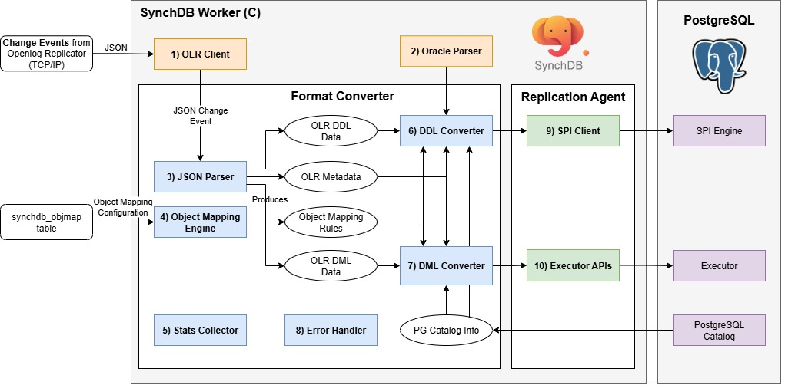

# Openlog Replicator Event Processor

## **Debezium Event Processor Component Diagram**



Openlog Replicator Event Processor is a PostgreSQL background worker initiated and started by the SynchDB extension. It is responsible for connecting to Openlog Replicator, initiate replication, and fetch change events in JSON format. The internal components of this module are listed below:

1. OLR Client
2. Oracle Parser
3. JSON Parser
4. Object Mapping Engine
5. Stats Collector
6. DDL Converter
7. DML Converter
8. Error Handler
9. SPI Client
10. Executor API

### **1) OLR Client**

OLR Client establishes a TCP/IP session with an OpenLog Replicator (OLR) server, negotiates a replication stream via a protocol handshake (e.g., protocol version and starting offset/SCN), and then continuously consumes change events emitted as JSON. Wire-level frames (handshake, acknowledgements, heartbeats) are encoded/decoded with libprotobuf-c, using the .proto definitions sourced directly from the official OpenLog Replicator [repository](https://github.com/bersler/OpenLogReplicator) to ensure strict protocol compatibility. After decoding, events are normalized to JSON and handed off to `3) JSON parser` for downstream processing.

### **2) Oracle Parser**

The Oracle Parser is responsible for parsing a Oracle query (DDL only) and producing a PostgreSQL raw parse tree, in which SynchDB can understand the intended actions. SynchDb's Oracle Parser is based on [IvorySQL 4](https://github.com/IvorySQL/IvorySQL)'s Oracle parser for PostgreSQL but modified to fit the needs of SynchDB. The source code of this modified Oracle parser is located in `src/backend/olr/oracle_parser` and it does not support all Oracle syntax. It is sufficient to support all the DDL commands we intended to support (See below).

### **3) JSON Parser**

The JSON Parser is responsible for parsing the incoming JSON change event into C structures that SynchDB can work with. SynchDB relies on PostgreSQL's native JSONB utility for all the parsing and iteration needs. Each DML event contains the `scn` and `commit scn` values, tells how each column value is represented based on data types, and the before / after values. 

Unlink a DDL event from Debezium, Openlog Replicator's DDL Event contains the raw Oracle DDL query instead of a broken-down structure. This means that a `2) Oracle parser` is required to parse this DDL query further to learn about its intended actions.

**DML payload:**
```json
{
  "scn": 3531590,
  "tm": 1752686342000000000,
  "c_scn": 3531691,
  "c_idx": 2,
  "xid": "0x0007.01a.000004a1",
  "db": "FREE",
  "payload": [
    {
      "op": "c",
      "schema": {
        "owner": "DBZUSER",
        "table": "ORDERS",
        "obj": 73406,
        "columns": [
          {
            "name": "ORDER_NUMBER",
            "type": "number",
            "precision": -1,
            "scale": -1,
            "nullable": false
          },
          {
            "name": "ORDER_DATE",
            "type": "date",
            "nullable": true
          },
          {
            "name": "PURCHASER",
            "type": "number",
            "precision": -1,
            "scale": -1,
            "nullable": true
          },
          {
            "name": "QUANTITY",
            "type": "number",
            "precision": -1,
            "scale": -1,
            "nullable": true
          },
          {
            "name": "PRODUCT_ID",
            "type": "number",
            "precision": -1,
            "scale": -1,
            "nullable": true
          }
        ]
      },
      "num": 0,
      "rid": "AAAR6+AAFAAAACGAAA",
      "after": {
        "ORDER_NUMBER": 10013,
        "ORDER_DATE": 1704067200000000000,
        "PURCHASER": 1003,
        "QUANTITY": 2,
        "PRODUCT_ID": 107
      }
    }
  ]
}
```

**DDL payload:**
```json
{
  "scn": 2930816,
  "tm": 1753384727000000000,
  "c_scn": 2930820,
  "c_idx": 3,
  "xid": "0x0008.011.000004c7",
  "db": "FREE",
  "payload": [
    {
      "op": "ddl",
      "schema": {
        "owner": "DBZUSER",
        "table": "TEST_TABLE",
        "obj": 74234
      },
      "sql": "CREATE TABLE test_table (\n    id NUMBER PRIMARY KEY,\n    binary_double_col BINARY_DOUBLE,\n    binary_float_col BINARY_FLOAT,\n    float_col FLOAT(10),\n    number_col NUMBER(10,2),\n    long_col LONG,\n    date_col DATE,\n    interval_ds_col INTERVAL DAY TO SECOND,\n    interval_ym_col INTERVAL YEAR TO MONTH,\n    timestamp_col TIMESTAMP,\n    timestamp_tz_col TIMESTAMP WITH TIME ZONE,\n    timestamp_ltz_col TIMESTAMP WITH LOCAL TIME ZONE,\n    char_col CHAR(10),\n    nchar_col NCHAR(10),\n    nvarchar2_col NVARCHAR2(50),\n    varchar_col VARCHAR(50),\n    varchar2_col VARCHAR2(50),\n    raw_col RAW(100),\n    bfile_col BFILE,\n    blob_col BLOB,\n    clob_col CLOB,\n    nclob_col NCLOB,\n    rowid_col ROWID,\n    urowid_col UROWID\n)"
    }
  ]
}
```

### **4) Object Mapping Engine**

The Object Mapping Engine is responsible for loading and maintaining object mapping information under each active connector. These mapping information tells SynchDB how to map a source object to a destination object during DDL and DML processing. By default, Synchdb has no object mapping rules, it will use the default mapping rules to process the data.

An object could refer to a:
* table name.
* column name.
* data type.
* transform expression.

It is possible to map a source table name, column name and data type to a different destination table name, column name an a data type before mapping rules can be created using`synchdb_add_objmap()` function and all rules can be viewed by quering the `synchdb_objmap` table. More on object mapping [here](../../user-guide/object_mapping_rules/). A summary of what gets mapped to what can be viewed under `synchdb_att_view()` VIEW.


The `transform expression` is a SQL expression that will be run (if specified) after the data conversion is finished and before data is applied. This expression can be any expressions runnable in PostgreSQL, such as invoking another SQL function, or using operators. More information on object mapping rule can be found [here](../../user-guide/object_mapping_rules/).


### **5) Stats Collector**

The Stats Collector is responsible for collecting statistic information about SynchDB's data processing since the beginning of the operation. This includes the number of DDLs and DMLs, how many CREATE, INSERT, UPDATE, DELETE operations have been processed, average batch size processed and several timestamps that describe the time when the data is first generated in the source, the time when the data is processed by Debezium and the time when the data is applied in PostgreSQL. These metrics can help user understand the processing behavior of SynchDB to tune and optimize settings to increase the processing performance. More on stats can be found [here](../../monitoring/stats_view).

### **6) DDL Converter**

The DDL Converter is responsible for converting the DDL data produced by the "JSON Parser" to a format that can be understood by PostgreSQL. For DDLs, SynchDB relies on PostgreSQL SPI engine to process, so the output of the conversion is a normal SQL query string. DDL Converter examines the DDL data and has to work with "Object Mapping Engine" to correctly transform the table, column name or data type mappings between the source and destination. 

If a remote table named "employee" is to be mapped as "staff" in the destination according to "Object Mapping Engine", DDL Converter is responsible for resolving these name mappings and create the SQL query for SPI accordingly.

The converter currently can handle these Oracle DDL operations:

* CREATE TABLE
* DROP TABLE
* ALTER TABLE MODIFY
* ALTER TABLE ADD COLUMN
* ALTER TABLE DROP COLUMN
* ALTER TABLE ADD CONSTRAINT
* ALTER TABLE DROP CONSTRAINT

#### Limitations

The following Oracle features declared in DDL commands are not supported by Openlog Replicator connector:

* virtual columns
* quoted table or column names with space
* Index organized tables (IOT)
* `CREATE TABLE AS` clauses
* `CREATE TYPE` clauses
* `CREATE TABLE OF` caluses
* `ALTER TABLE MODIFY name DEFAULT`
* `ALTER TABLE MODIFY name NOT NULL`
* `ALTER TABLE MODIFY name NULL`
* `ALTER TABLE MODIFY name SET UNUSED`
* `ALTER TABLE MODIFY name DROP UNUSED COLUMNS`
* `ALTER TABLE RENAME`


The following constraints clauses are accpeted but ignored by Openlog Replicator connector:

* ENABLE VALIDATE
* ENABLE NOVALIDATE
* DISABLE VALIDATE
* DISABLE NOVALIDATE

The following is treated as DEFAULT NULL:

* DEFAULT ON NULL 'expr'
* DEFAULT 'expr'

The following can only take one set of column definition rather than multiple

* `ALTER TABLE MODIFY ADD ...` 
* `ALTER TABLE MODIFY (ADD ...)` 
* `ALTER TABLE MODIFY DROP ...` 
* `ALTER TABLE MODIFY (DROP ...)` 

<**NOTE**> More limitations may be updated here as we discover them.

### **7) DML Converter**

The DML Converter is responsible for converting the DML data produced by the "JSON Parser" to a format that can be understood by PostgreSQL. For DMLs, SynchDB relies on PostgreSQL's executor APIs to directly apply the data to PostgreSQL, so the output of the conversion is in TupleTableSlot (TTS) format in which PostgreSQL executor understands. To produce the correct TTS for PostgreSQL, DML Converter relies on:

* The schema metadata that describes how the payload data is represented
* PostgreSQL catalog (pg_class and pg_type) to learn about the table's information, each column's data type and properties. 
* Object Mapping Rules to determine if it needs to run additional transform expression on the processed data
* The payload data itself to process

DML Converter consists of several routines that can handle a particular input data type and produce a particular output type. Selecting the right routine for a particular conversion scenario could be a challenge because some data types may be user-defined or created by another extensions that SynchDB does not know much about. SynchDB has to be designed to handle both native and non-native data type that could exist in PostgreSQL.

The routine selection starts by looking at the data type created at the PostgreSQL, which can be divided into 2 types, each with slightly different handling techniques:

* [native data types](../../architecture/native_datatype_handling/).
* [non-native data types](../../architecture/non_native_datatype_handling/).


#### **Data Transformation**
After the input data has been processed by the logics as described above, the converter will then check if the user has configured a `transform expression` that shall be applied to the processed data before applying to PostgreSQL. A transform expression could be any PostgreSQL expressions, commands, or SQL functions that could be run on a psql prompt. It uses the `%d` as a placeholder character that will be replaced with the processed data during the transformation. For example, a transform expression "'>>>>>' || '%d' || '<<<<<'" will prepend and append additional characters to the processed string data. 

So, if a non-native data type has category TYPCATEGORY_USER, DML Converter does not have a suitable routine to process this data and will leave it as is, we can define a transform expression to call a custom SQL function from where it knows how to properly handle the data and produce a suitable output. For example, the expression, "to_my_composite_type('%d')" will call a user-defined SQL function `to_my_composite_type` with the data as input. The expression must have a return value as it will be fed into PostgreSQL during apply.


### **8) Error Handler**

The Error Handler is primarily responsible for handling any error that could arise from each stage of data synchronization. Format Converter supports several error handling strategies that can be configured via "synchdb.error_handling_strategy" parameters. Details can be found [here](../../user-guide/configure_error_strategies/).


### **9) SPI Client**

the SPI Client component exists under the Replication Agent, which serves as a bridge between PostgreSQL core and SynchDB. It is responsible for establishing a connection to SPI server, start a transaction, obtain a snapshot and execute a given SQL query created by the `DDL Converter` and destroy the connection. For each query to process, the SPI connection is created and destroyed, which may seem inefficient. Since the SPI is only used during DDL, which is normally not very frequent, it should be fine in terms of performance.

### **10) Executor APIs**

Also residing in the Replication Agent. This component is responsible for initialize a executor context, open the table, acquire proper locks, create TupleTableSlot (TTS) from the output of DML Converter, call the executor API to execute INSERT, UPDATE, DELETE operations and do resource cleanup. This is generally a much faster approach to do data operations than SPI because it does not need to parse an input query string likst SPI does.