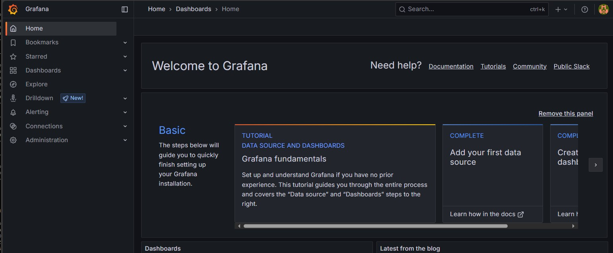
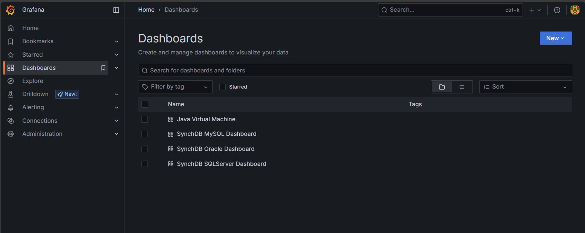
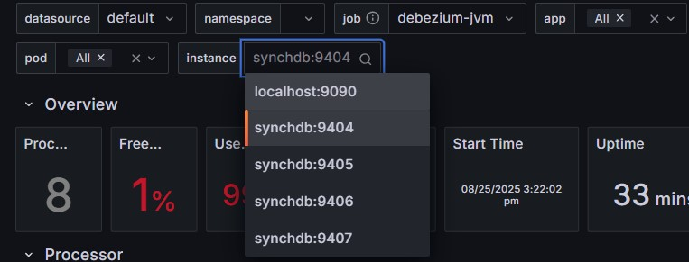
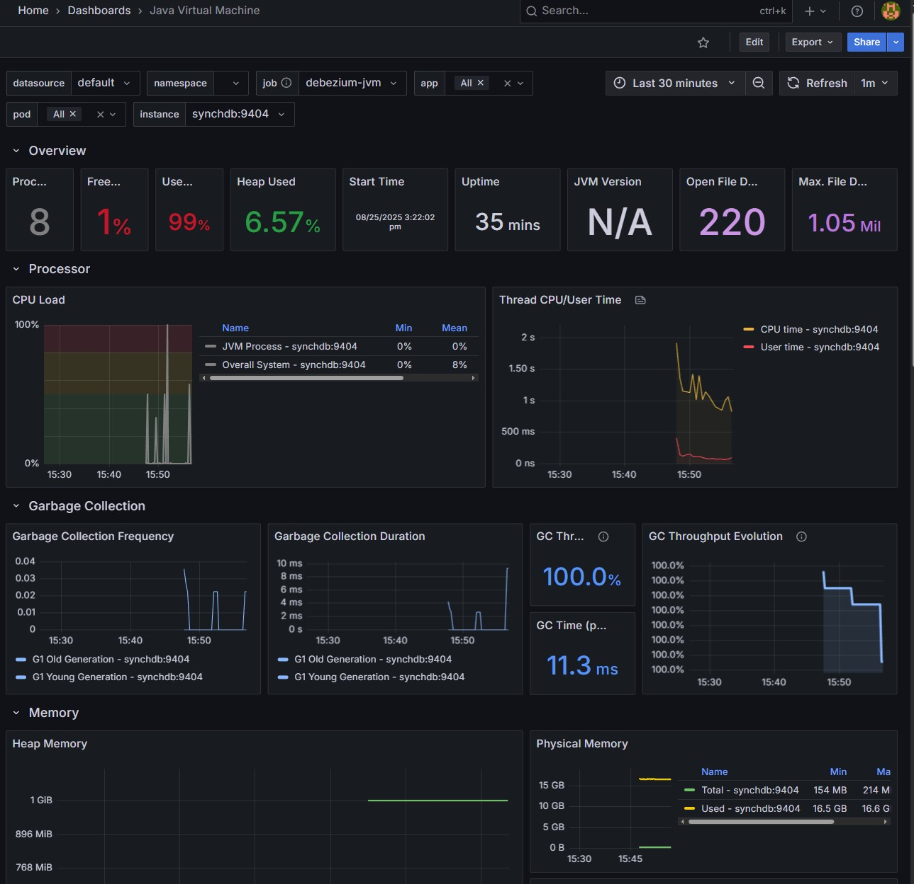
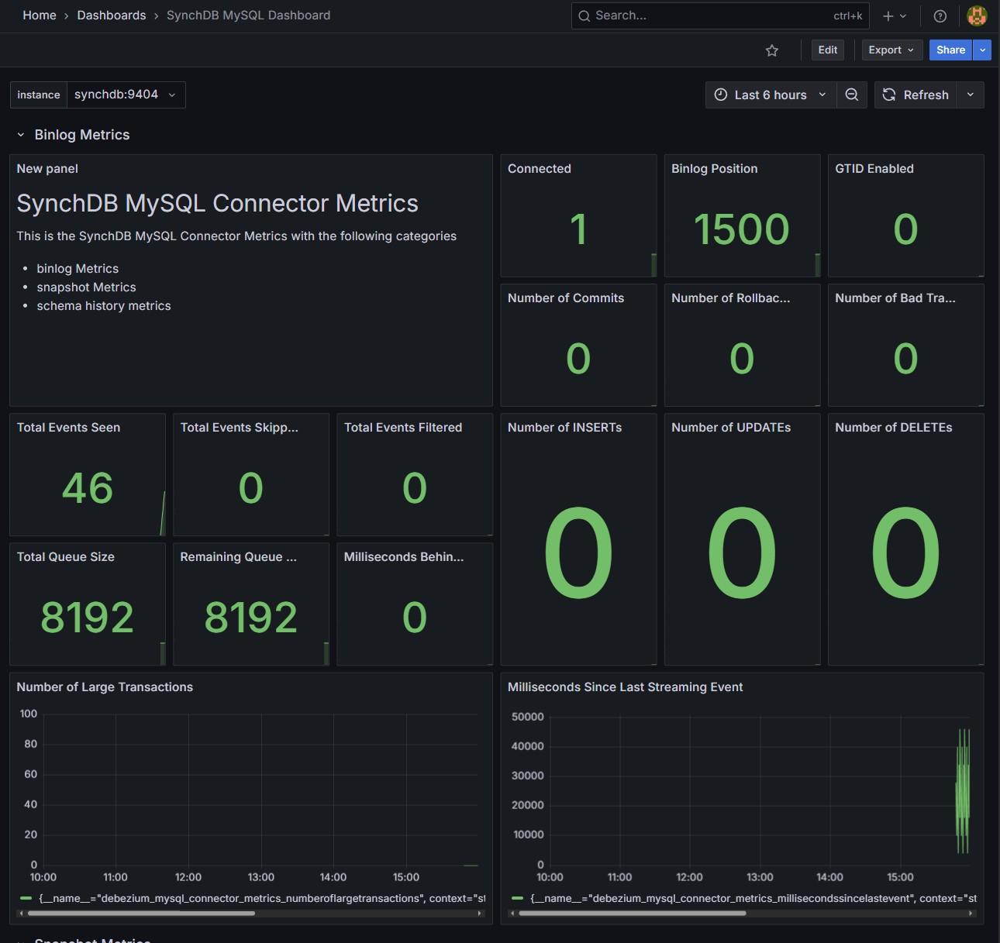
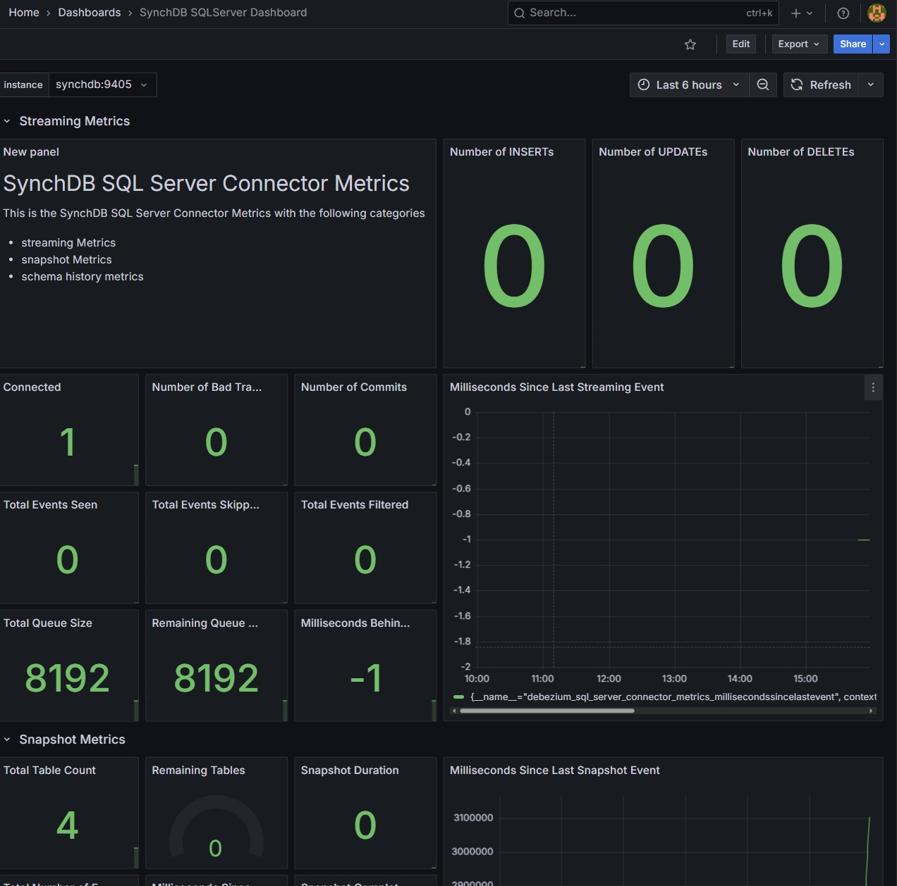
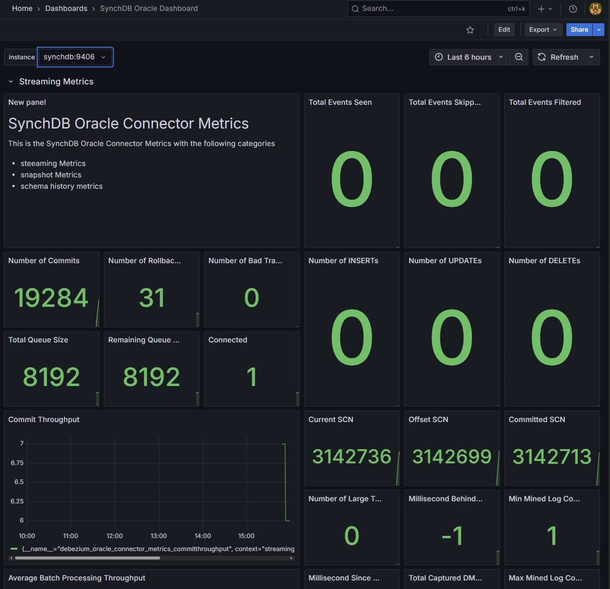

# Quick Start Guide

The fastest way to try SynchDB is with the pre-built Docker images for SynchDB and companion sources (MySQL, SQL Server, Oracle, etc.). Use the repo’s `ezdeploy.sh` (Linux only) to guide you with simple interactive prompts to spin up your chosen sources plus optional Prometheus/Grafana, so you can validate capture and replication in minutes. 

## **ezdeploy.sh**

This tool can be downloaded from SynchDB source repository [here](https://github.com/Hornetlabs/synchdb). It requires `docker`, and `docker-compose` (or `docker compose`) and must be run on Linux. It prints a list of deployment options when run:

```bash

./ezdeploy.sh
----------------------------------
-----> Welcome to ezdeploy! <-----
----------------------------------

please select a quick deploy option:
         1) synchdb only
         2) synchdb + mysql
         3) synchdb + sqlserver
         4) synchdb + oracle23ai
         5) synchdb + oracle19c
         6) synchdb + olr(oracle19c)
         7) synchdb + all source databases
         8) custom deployment
         9) deploy monitoring
        10) teardown deployment
enter your selection:

```

* For synchdb deployment only, use option `1)`.
* For synchdb + 1 source database, use option `2)` to `6)`.
* For synchdb + all source databases, use option `7)`.
* For synchdb + custom source databases, use option `8)`.
* For prometheus and grafana monitoring deployment, use option `9)`.
* to teardown all deployment, use option `10)`.

## **Access Details of Source Databases for Testing**

**MySQL:**

* database: inventory
* schema: N/A
* user: mysqluser
* password: mysqlpwd

**Sqlserver:**

* database: testDB
* schema: dbo
* user: sa
* password: Password!

**Oracle23ai:**

* database: FREE
* schema: c##dbzuser
* user: c##dbzuser
* password: dbz

**Oracle19c:**

* database: FREE
* schema: DBZUSER
* user: DBZUSER
* password: dbz

**Openlog Replicator (OLR):**

* service name: ORACLE

## **Access Synchdb with psql**

Once deployed, synchdb can be accessed by:

```bash
docker exec -it synchdb bash -c "psql -d postgres"

```

Once connected, create the `synchdb` extension:

```sql
CREATE EXTENSION synchdb CASCADE;

```

## **Create a Connector**

Here are some examples to create a basic connector for each supported source database type.

**MySQL:**
```sql
SELECT synchdb_add_conninfo('mysqlconn',
                            'mysql',
                            3306,
                            'mysqluser',
                            'mysqlpwd',
                            'inventory',
                            'postgres',
                            'null',
                            'null',
                            'mysql');

```

**Sqlserver:**
```sql
SELECT synchdb_add_conninfo('sqlserverconn',
                            'sqlserver', 
                            1433,
                            'sa',
                            'Password!',
                            'testDB',
                            'postgres',
                            'null',
                            'null',
                            'sqlserver');

```

**Oracle23ai:**
```sql
SELECT synchdb_add_conninfo('oracleconn',
                            'oracle',
                            1521,
                            'c##dbzuser',
                            'dbz',
                            'FREE',
                            'postgres',
                            'null',
                            'null',
                            'oracle');

```

**Oracle19c:**
```sql
SELECT synchdb_add_conninfo('ora19cconn',
                            'ora19c',
                            1521,
                            'DBZUSER',
                            'dbz',
                            'FREE',
                            'postgres',
                            'null',
                            'null',
                            'oracle');

```

**OLR(Oracle19c):**
```sql
SELECT synchdb_add_conninfo('olrconn',
                            'ora19c',
                            1521,
                            'DBZUSER',
                            'dbz',
                            'FREE',
                            'postgres',
                            'null',
                            'null',
                            'olr');

SELECT synchdb_add_olr_conninfo('olrconn',
                                'OpenLogReplicator',
                                7070,
                                'ORACLE');

```

**View Created Connectors:**

```sql
SELECT * FROM synchdb_conninfo;

```

More details on creating a connector can be found [here](user-guide/create_a_connector/)

## **Create Object Mappings**

By default, source database names will be mapped to a schema name in destination. Object mappings can be used to change this schema name. Let's change the destination schema for `orders` table from oracle based connectors and leave the rest as default.

```sql
SELECT synchdb_add_objmap('oracleconn','table','free.c##dbzuser.orders','oracle23ai.orders');
SELECT synchdb_add_objmap('ora19cconn','table','free.dbzuser.orders','oracle19c.orders');
SELECT synchdb_add_objmap('olrconn','table','free.dbzuser.orders','olr.orders');

```

More details on creating a object mappings can be found [here](user-guide/object_mapping_rules/)

## **Create JMX Exporter - Optional**

Here are some examples to enable JMX exporter for monitoring (If Prometheus + Grafana have been pre-deployed by `ezdeploy.sh`):

**MySQL:**
```sql
SELECT synchdb_add_jmx_exporter_conninfo(
                            'mysqlconn',
                            '/home/ubuntu/jmx_prometheus_javaagent-1.3.0.jar',
                            9404,
                            '/home/ubuntu/jmxexport.conf');

```

**Sqlserver:**
```sql
SELECT synchdb_add_jmx_exporter_conninfo(
                            'sqlserverconn',
                            '/home/ubuntu/jmx_prometheus_javaagent-1.3.0.jar',
                            9405,
                            '/home/ubuntu/jmxexport.conf');

```

**Oracle23ai:**
```sql
SELECT synchdb_add_jmx_exporter_conninfo(
                            'oracleconn',
                            '/home/ubuntu/jmx_prometheus_javaagent-1.3.0.jar',
                            9406,
                            '/home/ubuntu/jmxexport.conf');

```

**Oracle19c:**
```sql
SELECT synchdb_add_jmx_exporter_conninfo(
                            'ora19cconn',
                            '/home/ubuntu/jmx_prometheus_javaagent-1.3.0.jar',
                            9407,
                            '/home/ubuntu/jmxexport.conf');

```

More details on creating a JMX Exporter can be found [here](monitoring/jmx_exporter/)

## **Start a Connector**

**MySQL:**
```sql
SELECT synchdb_start_engine_bgw('mysqlconn');

```

**Sqlserver:**
```sql
SELECT synchdb_start_engine_bgw('sqlserverconn');

```

**Oracle23ai:**
```sql
SELECT synchdb_start_engine_bgw('oracleconn');

```

**Oracle19c:**
```sql
SELECT synchdb_start_engine_bgw('ora19cconn');

```

**OLR(Oracle19c):**
```sql
SELECT synchdb_start_engine_bgw('olrconn');

```

More details on connector start can be found [here](user-guide/start_stop_connector/)

## Check Connector Running State

Use `synchdb_state_view()` to examine all connectors' running states. 

``` SQL
SELECT * FROM synchdb_state_view;

```

Example outputs:
``` SQL
postgres=# SELECT * FROM synchdb_state_view;
     name      | connector_type |  pid   |       stage      |  state  |   err    |                                           last_dbz_offset
---------------+----------------+--------+------------------+---------+----------+------------------------------------------------------------------------------------------------------
 sqlserverconn | sqlserver      | 579820 | initial snapshot | polling | no error | {"commit_lsn":"0000006a:00006608:0003","snapshot":true,"snapshot_completed":false}
 mysqlconn     | mysql          | 579845 | initial snapshot | polling | no error | {"ts_sec":1741301103,"file":"mysql-bin.000009","pos":574318212,"row":1,"server_id":223344,"event":2}
 oracleconn    | oracle         | 580053 | initial snapshot | polling | no error | offset file not flushed yet
 ora19cconn    | oracle         | 593421 | initial snapshot | polling | no error | offset file not flushed yet
 olrconn       | oracle         | 601235 | initial snapshot | polling | no error | offset file not flushed yet
(5 rows)

```

More on running states [here](monitoring/state_view/), and also running statistics [here](monitoring/stats_view/).


## Check the Tables and Data from Initial Snapshot
By default, the connector will perform a `initial` snapshot to capture both the table schema and initial data, convert and apply them to PostgreSQL under different `schema`. You should see something similar to the following:

**MySQL:**
```sql
\dt inventory.*

```

```sql
\dt inventory.*
               List of relations
  Schema   |       Name       | Type  | Owner
-----------+------------------+-------+--------
 inventory | addresses        | table | ubuntu
 inventory | customers        | table | ubuntu
 inventory | geom             | table | ubuntu
 inventory | orders           | table | ubuntu
 inventory | products         | table | ubuntu
 inventory | products_on_hand | table | ubuntu
(6 rows)
```

**Sqlserver:**
```sql
\dt testdb.*

```

```sql
\dt testdb.*
             List of relations
 Schema |       Name       | Type  | Owner
--------+------------------+-------+--------
 testdb | customers        | table | ubuntu
 testdb | orders           | table | ubuntu
 testdb | products         | table | ubuntu
 testdb | products_on_hand | table | ubuntu
(4 rows)

```

**Oracle23ai**
```sql
\dt oracle23ai.*

```

```sql
\dt oracle23ai.*
          List of relations
   Schema   |  Name  | Type  | Owner
------------+--------+-------+--------
 oracle23ai | orders | table | ubuntu
(1 row)

```

**Oracle19c**
```sql
\dt oracle19c.*

```

```sql
\dt oracle19c.*
          List of relations
  Schema   |  Name  | Type  | Owner
-----------+--------+-------+--------
 oracle19c | orders | table | ubuntu
(1 row)
```

**OLR**
```sql
\dt olr.*

```

```sql
\dt olr.*
        List of relations
 Schema |  Name  | Type  | Owner
--------+--------+-------+--------
 olr    | orders | table | ubuntu
(1 row)
```

## Similate an INSERT Event and Observe CDC

We can use `docker exec` to similate an INSERT for each connector type and observe the Change Data Capture (CDC).

**MySQL:**
```bash
docker exec -i mysql mysql -D inventory -umysqluser -pmysqlpwd -e "INSERT INTO orders(order_date, purchaser, quantity, product_id) VALUES ('2025-12-12', 1002, 10000, 102)"

```

```sql
postgres=# SELECT * from inventory.orders;
 order_number | order_date | purchaser | quantity | product_id
--------------+------------+-----------+----------+------------
        10001 | 2016-01-16 |      1001 |        1 |        102
        10002 | 2016-01-17 |      1002 |        2 |        105
        10003 | 2016-02-19 |      1002 |        2 |        106
        10004 | 2016-02-21 |      1003 |        1 |        107
        10005 | 2025-12-12 |      1002 |    10000 |        102
(5 rows)

```

**Sqlserver:**
```bash
docker exec -i sqlserver /opt/mssql-tools18/bin/sqlcmd -U sa -P 'Password!' -d testDB -C -Q "INSERT INTO orders(order_date, purchaser, quantity, product_id) VALUES ('2025-12-12', 1002, 10000, 102)"

```

```sql
postgres=# SELECT * from testdb.orders;
 order_number | order_date | purchaser | quantity | product_id
--------------+------------+-----------+----------+------------
        10001 | 2016-01-16 |      1001 |        1 |        102
        10002 | 2016-01-17 |      1002 |        2 |        105
        10003 | 2016-02-19 |      1002 |        2 |        106
        10004 | 2016-02-21 |      1003 |        1 |        107
        10005 | 2025-12-12 |      1002 |    10000 |        102
(5 rows)

```

**Oracle23ai:**
```bash
echo -ne "INSERT INTO orders(order_number, order_date, purchaser, quantity, product_id) VALUES (10005, TO_DATE('2025-12-12', 'YYYY-MM-DD'), 1002, 10000, 102);\n" | docker exec -i oracle sqlplus c##dbzuser/dbz@//localhost:1521/FREE

```

```sql
postgres=# SELECT * FROM oracle23ai.orders;
 order_number |     order_date      | purchaser | quantity | product_id
--------------+---------------------+-----------+----------+------------
        10001 | 2024-01-01 00:00:00 |      1003 |        2 |        107
        10002 | 2024-01-01 00:00:00 |      1003 |        2 |        107
        10003 | 2024-01-01 00:00:00 |      1003 |        2 |        107
        10004 | 2024-01-01 00:00:00 |      1003 |        2 |        107
        10005 | 2025-12-12 00:00:00 |      1002 |    10000 |        102
(5 rows)

```

**Oracle19c:**
```bash
echo -ne "INSERT INTO orders(order_number, order_date, purchaser, quantity, product_id) VALUES (10005, TO_DATE('2025-12-12', 'YYYY-MM-DD'), 1002, 10000, 102);\n" | docker exec -i ora19c sqlplus DBZUSER/dbz@//localhost:1521/FREE

```

```sql
postgres=# SELECT * FROM oracle19c.orders;
 order_number |     order_date      | purchaser | quantity | product_id
--------------+---------------------+-----------+----------+------------
        10001 | 2024-01-01 00:00:00 |      1003 |        2 |        107
        10002 | 2024-01-01 00:00:00 |      1003 |        2 |        107
        10003 | 2024-01-01 00:00:00 |      1003 |        2 |        107
        10004 | 2024-01-01 00:00:00 |      1003 |        2 |        107
        10005 | 2025-12-12 00:00:00 |      1002 |    10000 |        102
(5 rows)

```

**OLR:**
```bash
echo -ne "INSERT INTO orders(order_number, order_date, purchaser, quantity, product_id) VALUES (10005, TO_DATE('2025-12-12', 'YYYY-MM-DD'), 1002, 10000, 102);\n" | docker exec -i ora19c sqlplus DBZUSER/dbz@//localhost:1521/FREE

```

```sql
postgres=# SELECT * FROM olr.orders;
 order_number |     order_date      | purchaser | quantity | product_id
--------------+---------------------+-----------+----------+------------
        10001 | 2024-01-01 00:00:00 |      1003 |        2 |        107
        10002 | 2024-01-01 00:00:00 |      1003 |        2 |        107
        10003 | 2024-01-01 00:00:00 |      1003 |        2 |        107
        10004 | 2024-01-01 00:00:00 |      1003 |        2 |        107
        10005 | 2025-12-12 00:00:00 |      1002 |    10000 |        102
(5 rows)

```

## Connector Metrics on Grafana - Optional



Connector metrics will be available on Grafana if you choose to deploy monitoring using `ezdeploy.sh` and have called the optional `synchdb_add_jmx_exporter_conninfo()` before starting the connector. 

* **Access Grafana:** http://localhost:3000/
* **Default Login:** admin/admin (You will be required to change password on first time login)

**Nativate to the dashboards menu:**


**Select desired templates:**
* Java Virtual Machine - resource information about JVM
* SynchDB MySQL Dashboard - information about MySQL connector
* SynchDB SQLServer Dashboard - information about SQLServer connector
* SynchDB Oracle Dashboard - information about Oracle connector


**Select desired Instance:**
Each connector with JMX exporter enabled is bound to a dedicated port number so that prometheus can fetch the data from. Use the instance drop-down menu to select a connector by port number.



**Java Virtual Machine Dashboard:**


**MySQL Dashboard:**


**SQLServer Dashboard:**


**Oracle Dashboard:**


## **Stop and Remove a Connector**

**MySQL:**
```sql
SELECT synchdb_stop_engine_bgw('mysqlconn');
SELECT synchdb_del_conninfo('mysqlconn');

```

**Sqlserver:**
```sql
SELECT synchdb_stop_engine_bgw('sqlserverconn');
SELECT synchdb_del_conninfo('sqlserverconn');

```

**Oracle23ai:**
```sql
SELECT synchdb_stop_engine_bgw('oracleconn');
SELECT synchdb_del_conninfo('oracleconn');

```

**Oracle19c:**
```sql
SELECT synchdb_stop_engine_bgw('ora19cconn');
SELECT synchdb_del_conninfo('ora19cconn');

```

**OLR(Oracle19c):**
```sql
SELECT synchdb_stop_engine_bgw('olrconn');
SELECT synchdb_del_conninfo('olrconn');

```