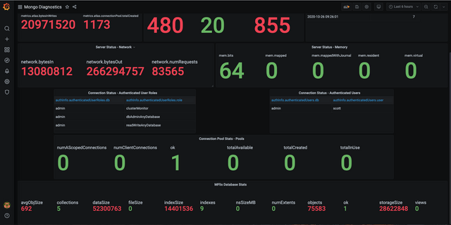

# JMX Exporter

## What is JMX Exporter

JMX Exporter (also known as the JMX Prometheus Java Agent) is a Java agent that exposes JMX metrics of a Java application in a format Prometheus can scrape and monitor. It is a tool created by the Prometheus community that allows:

* Access JVM internal metrics (like memory usage, thread count, GC stats, etc.)
* Expose custom application metrics exposed via MBeans
* Export these metrics via an HTTP endpoint (e.g., http://localhost:9404/metrics)
* Integrate Java applications (like Kafka, Cassandra, or your own apps) into a Prometheus monitoring setupx

This tool unlocks Prometheus + Graphana based monitoring for a SynchDB Connector



## Obtain JMX Exporter

Pre-compiled JMX Exporter (.jar) are available on official [JMX Exporter release page](https://github.com/prometheus/jmx_exporter/releases). We are interested in the "jmx_prometheus_javaagent" tool such as:

```
jmx_prometheus_javaagent-1.3.0.jar

```

Please download it to the same machine where SynchDB connector is running.

## Write a JMX Exporter Conf File

JMX exporter requires a config file to define the behavior of exposing metrics. Below is a basic configuration template to get started.

```
startDelaySeconds: 0
ssl: false
lowercaseOutputName: true
lowercaseOutputLabelNames: true

rules:
  - pattern: ".*"

```

Refer to the [official prometheus documentation](https://prometheus.github.io/jmx_exporter/1.3.0/http-mode/rules/) for more advanced configuration parameters and their usage.

## Configure JMX Exporter to a SynchDB Connector

The synchdb_add_jmx_exporter_conninfo() and synchdb_del_jmx_exporter_conninfo() functions adds or deletes JMX exporter configuration to or from an existing connector. This enables runtime monitoring and diagnostics via tools like Prometheus and Graphana.

**Function Signature**

```
synchdb_add_jmx_exporter_conninfo(
    name TEXT,
    exporter_jar_path TEXT,
    exporter_port INTEGER,
    config_file_path TEXT
);

synchdb_del_jmx_exporter_conninfo(
    name text
)

```

| Parameter           | Type   | Description                                                                 |
| ------------------- | ------ | --------------------------------------------------------------------------- |
| `connector_name`    | `TEXT` | Name of the existing connector you want to attach the JMX Exporter to.      |
| `exporter_jar_path` | `TEXT` | Absolute path to the `jmx_prometheus_javaagent.jar` file.                   |
| `exporter_port`     | `INT`  | Port on which the JMX Exporter HTTP server will expose metrics (e.g. 9404). |
| `config_file_path`  | `TEXT` | Path to the JMX Exporter's YAML configuration file we defined above.        |


```sql
SELECT synchdb_add_jmx_exporter_conninfo(
	'mysqlconn',	-- existing connector name
	'/path/to/jmx_exporter/jar',		-- path to JMX exporter java agent jar
	9404,			-- JMX exporter running port
	'/path/to/jmx/conf');		-- path to JMX exporter conf file

```

## Obtain Metrics via HTTP

when the connector starts with JMX exporter settings, it will expose metrics at:

```
http://<host>:9404/metrics
```

we can test it by:

```
curl http://<host>:9404/metrics

# HELP debezium_mysql_connector_metrics_binlogposition debezium.mysql:name=null,type=connector-metrics,attribute=BinlogPosition
# TYPE debezium_mysql_connector_metrics_binlogposition untyped
debezium_mysql_connector_metrics_binlogposition{context="streaming",server="synchdb-connector"} 1500.0
# HELP debezium_mysql_connector_metrics_changesapplied debezium.mysql:name=null,type=connector-metrics,attribute=ChangesApplied
# TYPE debezium_mysql_connector_metrics_changesapplied untyped
debezium_mysql_connector_metrics_changesapplied{context="schema-history",server="synchdb-connector"} 39.0
# HELP debezium_mysql_connector_metrics_changesrecovered debezium.mysql:name=null,type=connector-metrics,attribute=ChangesRecovered
# TYPE debezium_mysql_connector_metrics_changesrecovered untyped
debezium_mysql_connector_metrics_changesrecovered{context="schema-history",server="synchdb-connector"} 26.0
# HELP debezium_mysql_connector_metrics_connected debezium.mysql:name=null,type=connector-metrics,attribute=Connected
# TYPE debezium_mysql_connector_metrics_connected untyped
debezium_mysql_connector_metrics_connected{context="streaming",server="synchdb-connector"} 1.0

...
...
...
```

## Prometheus and Graphana

Once we have confirmed the metrics can be obtained via HTTP, then we can configure this endpoint to prometheus system and have it to `scrape` them all. Then we can create a prometheus data source in graphana and create a dashboard out of it. Please refer to prometheus and graphana [tutorial](https://grafana.com/docs/grafana/latest/getting-started/get-started-grafana-prometheus/) on how to do so.

For quick test, you could also use the `ezdeploy` tool to quickly deploy prometheus and grafana with built-in dashboard templates for Synchdb. Refer to the [Quick Start Guide](../../getting-started/quick_start/) for mode details. 