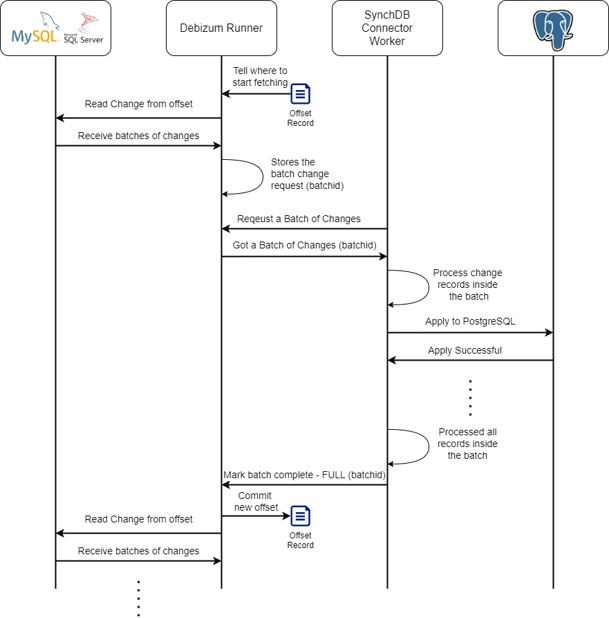

# 批量变更处理

## **概述**
SynchDB 以 `synchdb.naptime` 毫秒（默认 100）的周期从 Debezium 运行引擎定期获取一批变更请求。这批变更请求随后由 SynchDB 处理。如果批次中的所有变更请求都已成功处理（解析、转换并应用到 PostgreSQL），SynchDB 将通知 Debezium 运行引擎该批次已完成。这向 Debezium 运行器发出信号，提交直到最后一条成功完成的变更记录的偏移量。通过这种机制，SynchDB 能够跟踪每条变更记录，并指示 Debezium 运行器不要获取之前已处理的旧变更，或不要发送重复的变更记录。

## **批量处理**
SynchDB 在一个事务内处理一批变更（也叫一个 batch）。这意味着一批内的变更事件要么全部处理，要么全部不处理。当所有更改都成功处理后，SynchDB 会向 Debezium 运行器引擎发送一条消息，将批处理标记为已处理完成。此操作会导致偏移量（offset）被提交并最终刷新到磁盘。偏移量表示复制期间的逻辑位置，类似于 PostgreSQL 中的 LSN（日志序列号）。

如果一批更改在 PostgreSQL 上部分成功，则会导致事务回滚，并且 SynchDB 不会通知 Debezium 运行器批处理已完成。当连接器重新启动时，同一批将再次恢复处理。