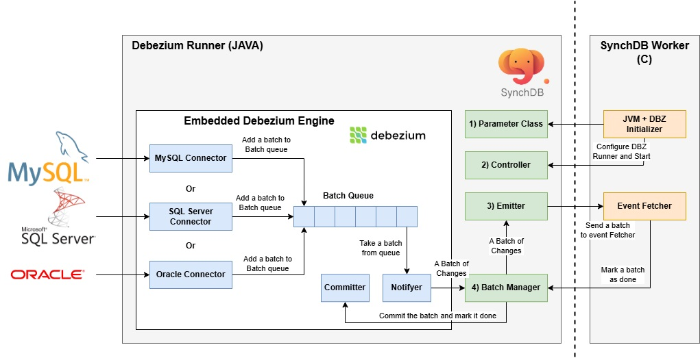

# Debezium Runner 组件架构 - Java

## **Debezium Runner 组件图**

Debezium Runner 位于部署的 Java 端。它是嵌入式 Debezium 引擎 (Java) 和 SynchDB Worker (C) 之间的主要中介。它提供了一些 Java 方法，SynchDB Worker 可以通过 JNI 库进行交互。这些交互包括初始化 Debezium 引擎、启动或停止引擎、获取一批变更事件以及将一批标记为完成。这些操作对于确保复制一致性至关重要。主要组件包括：

1. 参数类
2. 控制器
3. 发射器
4. 批次管理器

### **1) 参数类**

参数类表示一个 JAVA 类，其中包含一系列公开的参数和方法，允许 SynchDB Worker 设置/获取参数值。这些参数会影响 Debezium Runner 和嵌入式 Debezium 的性能。这些参数也已暴露给 PostgreSQL GUC，以便 SynchDB Worker 可以调用相应的方法来设置参数值。这是目前将配置从基于 C 语言的 SynchDB Worker 传递到基于 JAVA 语言的 Debezium Runner 的唯一方法。

### **2) 控制器**

控制器允许 SynchDB 启动或停止嵌入式 Debezium 引擎。这通过 SynchDB Worker 可以调用的几个 JAVA 方法来实现，这些方法可以控制 Debezium 引擎。

### **3) 发射器**

发射器表示一个 JAVA 方法，该方法由 SynchDB Worker 中的“事件获取器”组件定期调用。它主要负责从“4) 批次管理器”弹出一个批次，将其转换为 JSON 事件字符串列表，并通过 JNI 返回给“事件获取器”。如果批次管理器没有可用的批次，它将返回 NULL，并且“事件获取器”端不会进行任何处理。

### **4) 批次管理器**

批次管理器主要负责接收来自嵌入式 Debezium 引擎的新批次，并将其存储在其内部队列中。该队列比组件图中嵌入式 Debezium 引擎内部的批次队列小得多，并且有所不同。当批次管理器的内部队列已满时，节流控制将激活，暂时停止 Debezium 端的事件生成，直到该小批次队列有可用空间。只有当“发射器”收到来自“事件获取器”的获取请求并从批次管理器弹出批次时，才会从队列中移除该批次。

批次管理器还会为每个弹出的批次分配一个批次 ID，并将其发送到发射器，最终发送到 SynchDB 工作器进行处理。此唯一 ID 与其关联的“提交器”对象一起存储在其内部哈希表中。这些信息对于跟踪非常重要。当 SynchDB 工作进程完成一个批次时，它会在批次管理器中调用“标记批次完成”方法，并包含相同的批次 ID，这有助于批次管理器查找相应的“提交者”对象。提交者对象随后会通知嵌入式 Debezium 引擎该批次已完成，强制其提交并将其内部偏移量向前移动。这确保了在引擎重启后不会再次处理同一个批次（不会重复）。