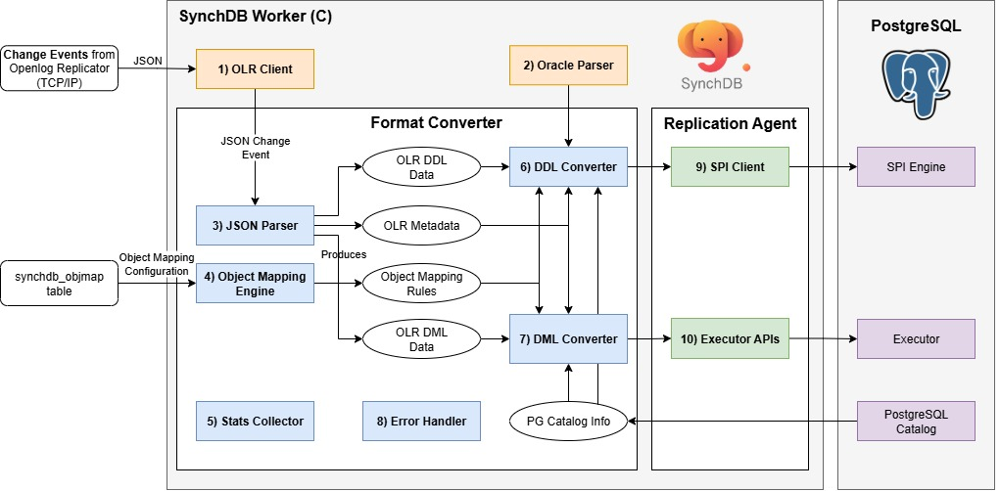

# Openlog Replicator 事件处理器

## **Debezium 事件处理器组件图**



Openlog Replicator 事件处理器是一个由 SynchDB 扩展启动的 PostgreSQL 后台工作器。它负责连接到 Openlog Replicator、启动复制并获取 JSON 格式的变更事件。该模块的内部组件如下：

1. OLR 客户端
2. Oracle 解析器
3. JSON 解析器
4. 对象映射引擎
5. 统计信息收集器
6. DDL 转换器
7. DML 转换器
8. 错误处理程序
9. SPI 客户端
10. 执行器 API

### **1) OLR 客户端**

OLR 客户端与 OpenLog Replicator (OLR) 服务器建立 TCP/IP 会话，通过协议握手协商复制流（例如，协议版本和起始偏移量/SCN），然后持续接收以 JSON 格式发送的变更事件。线级帧（握手、确认、心跳）使用 libprotobuf-c 进行编码/解码，并使用直接来自官方 OpenLog Replicator [仓库](https://github.com/bersler/OpenLogReplicator) 的 .proto 定义，以确保严格的协议兼容性。解码后，事件被规范化为 JSON，并交由 `3) JSON 解析器` 进行下游处理。

### **2) Oracle 解析器**

Oracle 解析器负责解析 Oracle 查询（仅限 DDL）并生成 PostgreSQL 原始解析树，以便 SynchDB 能够理解其预期操作。SynchDB 的 Oracle 解析器基于 [IvorySQL 4](https://github.com/IvorySQL/IvorySQL) 的 PostgreSQL Oracle 解析器，但根据 SynchDB 的需求进行了修改。修改后的 Oracle 解析器的源代码位于 `src/backend/olr/oracle_parser` 中，它并不支持所有 Oracle 语法。但它足以支持我们想要支持的所有 DDL 命令（见下文）。

### **3) JSON 解析器**

JSON 解析器负责将传入的 JSON 更改事件解析为 SynchDB 可以使用的 C 语言结构。 SynchDB 依赖于 PostgreSQL 原生的 JSONB 实用程序来满足所有解析和迭代需求。每个 DML 事件都包含 `scn` 和 `commit scn` 值，并根据数据类型说明每个列值的表示方式，以及执行前后值。

如果将 DDL 事件与 Debezium 解除关联，Openlog Replicator 的 DDL 事件将包含原始的 Oracle DDL 查询，而不是分解后的结构。这意味着需要一个 `2) Oracle 解析器` 来进一步解析此 DDL 查询，以了解其预期操作。

**DML 负载：**
```json
{
  "scn": 3531590,
  "tm": 1752686342000000000,
  "c_scn": 3531691,
  "c_idx": 2,
  "xid": "0x0007.01a.000004a1",
  "db": "FREE",
  "payload": [
    {
      "op": "c",
      "schema": {
        "owner": "DBZUSER",
        "table": "ORDERS",
        "obj": 73406,
        "columns": [
          {
            "name": "ORDER_NUMBER",
            "type": "number",
            "precision": -1,
            "scale": -1,
            "nullable": false
          },
          {
            "name": "ORDER_DATE",
            "type": "date",
            "nullable": true
          },
          {
            "name": "PURCHASER",
            "type": "number",
            "precision": -1,
            "scale": -1,
            "nullable": true
          },
          {
            "name": "QUANTITY",
            "type": "number",
            "precision": -1,
            "scale": -1,
            "nullable": true
          },
          {
            "name": "PRODUCT_ID",
            "type": "number",
            "precision": -1,
            "scale": -1,
            "nullable": true
          }
        ]
      },
      "num": 0,
      "rid": "AAAR6+AAFAAAACGAAA",
      "after": {
        "ORDER_NUMBER": 10013,
        "ORDER_DATE": 1704067200000000000,
        "PURCHASER": 1003,
        "QUANTITY": 2,
        "PRODUCT_ID": 107
      }
    }
  ]
}
```

**DDL 负载：**
```json
{
  "scn": 2930816,
  "tm": 1753384727000000000,
  "c_scn": 2930820,
  "c_idx": 3,
  "xid": "0x0008.011.000004c7",
  "db": "FREE",
  "payload": [
    {
      "op": "ddl",
      "schema": {
        "owner": "DBZUSER",
        "table": "TEST_TABLE",
        "obj": 74234
      },
      "sql": "CREATE TABLE test_table (\n    id NUMBER PRIMARY KEY,\n    binary_double_col BINARY_DOUBLE,\n    binary_float_col BINARY_FLOAT,\n    float_col FLOAT(10),\n    number_col NUMBER(10,2),\n    long_col LONG,\n    date_col DATE,\n    interval_ds_col INTERVAL DAY TO SECOND,\n    interval_ym_col INTERVAL YEAR TO MONTH,\n    timestamp_col TIMESTAMP,\n    timestamp_tz_col TIMESTAMP WITH TIME ZONE,\n    timestamp_ltz_col TIMESTAMP WITH LOCAL TIME ZONE,\n    char_col CHAR(10),\n    nchar_col NCHAR(10),\n    nvarchar2_col NVARCHAR2(50),\n    varchar_col VARCHAR(50),\n    varchar2_col VARCHAR2(50),\n    raw_col RAW(100),\n    bfile_col BFILE,\n    blob_col BLOB,\n    clob_col CLOB,\n    nclob_col NCLOB,\n    rowid_col ROWID,\n    urowid_col UROWID\n)"
    }
  ]
}
```

### **4) 对象映射引擎**

对象映射引擎负责加载和维护每个活动连接器下的对象映射信息。这些映射信息告诉 SynchDB 在 DDL 和 DML 处理过程中如何将源对象映射到目标对象。默认情况下，Synchdb 没有对象映射规则，它将使用默认映射规则来处理数据。

一个对象可以引用：
* 表名。
* 列名。
* 数据类型。
* 转换表达式。

在创建映射规则之前，可以使用 `synchdb_add_objmap()` 函数将源表名、列名和数据类型映射到不同的目标表名、列名和数据类型，所有规则都可以通过查询 `synchdb_objmap` 表来查看。更多关于对象映射的信息请参见[此处](user-guide/object_mapping_rules/)。在 `synchdb_att_view()` 视图下可以查看映射内容的摘要。

“转换表达式”是一个 SQL 表达式，它将在数据转换完成后、数据应用之前运行（如果指定）。此表达式可以是任何可在 PostgreSQL 中运行的表达式，例如调用其他 SQL 函数或使用运算符。更多关于对象映射规则的信息，请参见[此处](user-guide/object_mapping_rules/)。

### **5) 统计收集器**

统计收集器负责收集 SynchDB 自操作开始以来数据处理的统计信息。这包括 DDL 和 DML 的数量、已处理的 CREATE、INSERT、UPDATE 和 DELETE 操作的数量、处理的平均批次大小以及多个时间戳，这些时间戳分别描述了数据在源中首次生成的时间、Debezium 处理数据的时间以及数据在 PostgreSQL 中应用的时间。这些指标可以帮助用户了解 SynchDB 的处理行为，从而调整和优化设置，从而提高处理性能。更多关于统计数据的信息，请访问[此处](monitoring/stats_view)。

### **6) DDL 转换器**

DDL 转换器负责将“JSON 解析器”生成的 DDL 数据转换为 PostgreSQL 可以理解的格式。对于 DDL，SynchDB 依赖于 PostgreSQL SPI 引擎进行处理，因此转换的输出是普通的 SQL 查询字符串。DDL 转换器会检查 DDL 数据，并与“对象映射引擎”协作，以正确转换源和目标之间的表、列名或数据类型映射。

如果根据“对象映射引擎”，名为“employee”的远程表要在目标中映射为“staff”，则 DDL 转换器负责解析这些名称映射，并相应地为 SPI 创建 SQL 查询。

该转换器目前可以处理以下 Oracle DDL 操作：

* 创建表
* 删除表
* 修改表
* 修改表添加列
* 修改表删除列
* 修改表添加约束
* 修改表删除约束

#### 限制

Openlog Replicator 连接器不支持以下在 DDL 命令中声明的 Oracle 特性：

* 虚拟列
* 带空格的引用表名或列名
* 索引组织表 (IOT)
* `CREATE TABLE AS` 子句
* `CREATE TYPE` 子句
* `CREATE TABLE OF` 子句
* `ALTER TABLE MODIFY name DEFAULT`
* `ALTER TABLE MODIFY name NOT NULL`
* `ALTER TABLE MODIFY name NULL`
* `ALTER TABLE MODIFY name SET UNUSED`
* `ALTER TABLE MODIFY name DROP UNUSED COLUMNS`
* `ALTER TABLE RENAME`

Openlog Replicator 连接器接受但忽略以下约束子句：

* ENABLE VALIDATE
* ENABLE NOVALIDATE
* DISABLE VALIDATE
* DISABLE NOVALIDATE

以下内容将被视为 DEFAULT NULL：

* DEFAULT ON NULL 'expr'
* DEFAULT 'expr'

以下语句只能接受一组列定义，而不能接受多组。

* `ALTER TABLE MODIFY ADD ...`
* `ALTER TABLE MODIFY (ADD ...)`
* `ALTER TABLE MODIFY DROP ...` 
* `ALTER TABLE MODIFY (DROP ...)` 

<**注意**> 更多限制可能会在我们发现后在此处更新。

### **7) DML 转换器**

DML 转换器负责将“JSON 解析器”生成的 DML 数据转换为 PostgreSQL 可以理解的格式。对于 DML，SynchDB 依赖 PostgreSQL 的执行器 API 将数据直接应用于 PostgreSQL，因此转换的输出为 PostgreSQL 执行器可以理解的 TupleTableSlot (TTS) 格式。为了生成适用于 PostgreSQL 的正确 TTS，DML 转换器依赖于：

* 描述有效载荷数据如何表示的模式元数据
* PostgreSQL 目录（pg_class 和 pg_type），用于了解表的信息、每列的数据类型和属性。
* 对象映射规则，用于确定是否需要对已处理的数据运行额外的转换表达式
* 需要处理的有效载荷数据本身

DML 转换器包含多个例程，这些例程可以处理特定的输入数据类型并生成特定的输出类型。为特定的转换场景选择合适的例程可能是一个挑战，因为某些数据类型可能是用户定义的，或者由 SynchDB 不太了解的其他扩展创建。SynchDB 必须设计为能够处理 PostgreSQL 中可能存在的原生和非原生数据类型。

例程选择首先要查看 PostgreSQL 中创建的数据类型，该数据类型可分为两种类型，每种类型的处理技术略有不同：

* [原生数据类型](../../architecture/native_datatype_handling/)。
* [非原生数据类型](../../architecture/non_native_datatype_handling/)。

#### **数据转换**
输入数据按上述逻辑处理后，转换器将检查用户是否配置了“转换表达式”，该表达式应在应用于 PostgreSQL 之前应用于已处理的数据。转换表达式可以是任何可在 psql 提示符下运行的 PostgreSQL 表达式、命令或 SQL 函数。它使用“%d”作为占位符，在转换过程中将替换为已处理的数据。例如，转换表达式“'>>>>>' || '%d' || '<<<<<'”将在已处理的字符串数据前添加和后添加其他字符。

因此，如果非原生数据类型的类别为 TYPCATEGORY_USER，而 DML 转换器没有合适的例程来处理此类数据，因此会将其保留原样。我们可以定义一个转换表达式来调用自定义 SQL 函数，以便转换器知道如何正确处理数据并生成合适的输出。例如，表达式“to_my_composite_type('%d')”将调用用户定义的 SQL 函数“to_my_composite_type”，并以数据作为输入。该表达式必须有返回值，因为它将在应用期间被输入到 PostgreSQL 中。

### **8) 错误处理程序**

错误处理程序主要负责处理数据同步各个阶段可能出现的任何错误。格式转换器支持多种错误处理策略，可通过“synchdb.error_handling_strategy”参数进行配置。详细信息请参见[此处](../../user-guide/configure_error_strategies/)。

### **9) SPI 客户端**

SPI 客户端组件位于复制代理 (Replication Agent) 下，充当 PostgreSQL 核心和 SynchDB 之间的桥梁。它负责与 SPI 服务器建立连接、启动事务、获取快照、执行由“DDL 转换器”创建的 SQL 查询并销毁连接。对于每个要处理的查询，都会创建和销毁 SPI 连接，这看起来效率不高。由于 SPI 仅在 DDL 操作期间使用，而 DDL 通常不太频繁，因此性能方面应该不错。

### **10) 执行器 API**

也驻留在复制代理中。此组件负责初始化执行器上下文、打开表、获取适当的锁、从 DML 转换器的输出创建 TupleTableSlot (TTS)、调用执行器 API 执行 INSERT、UPDATE、DELETE 操作以及进行资源清理。通常，这是一种比 SPI 更快的数据操作方法，因为它不需要像 SPI 那样解析输入查询字符串。