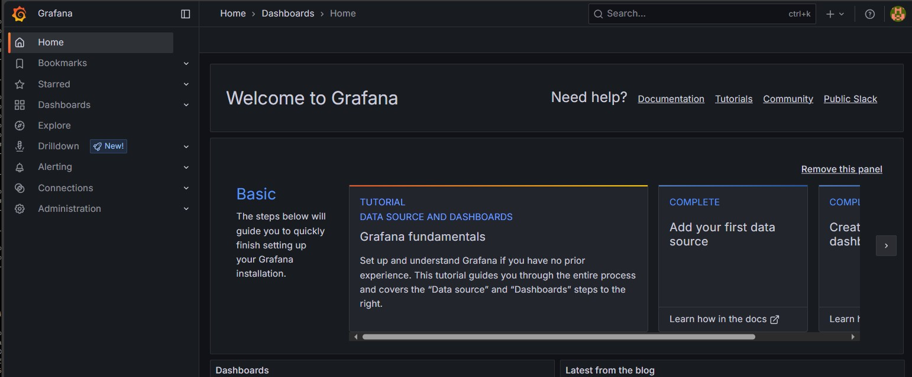
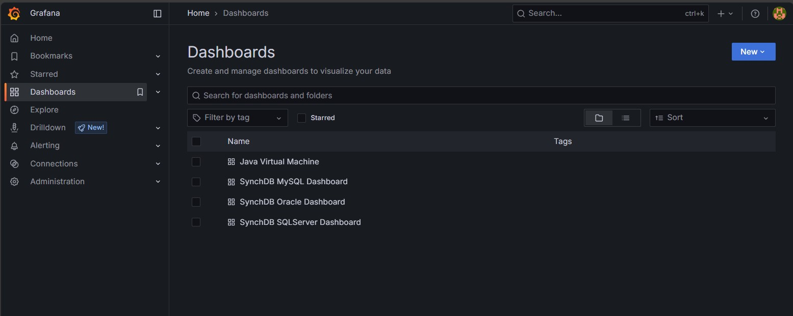
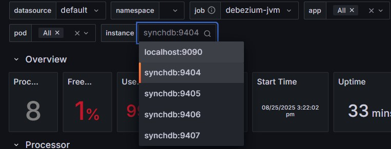
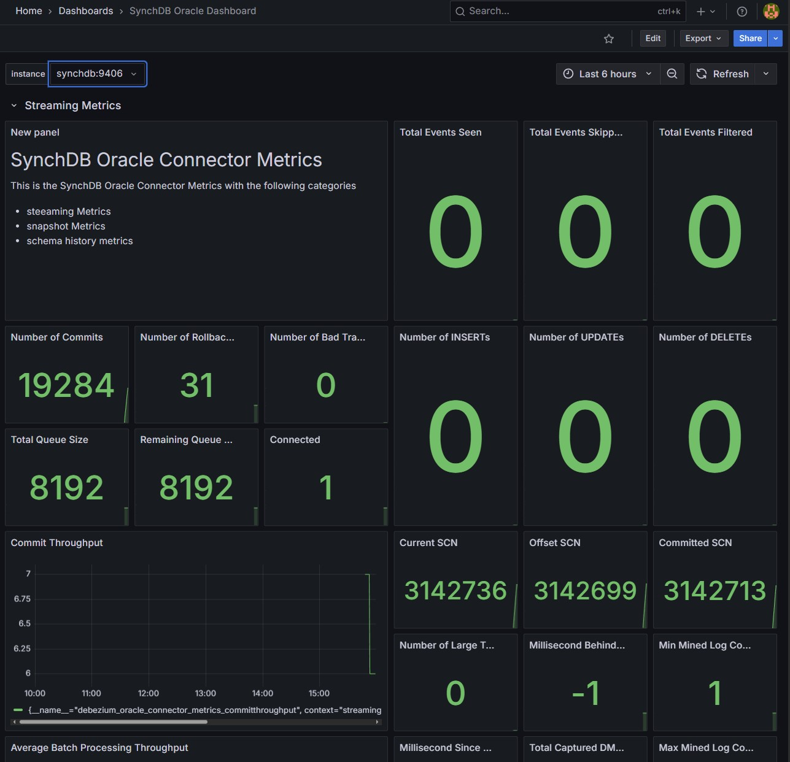

# 快速入门指南

尝试 SynchDB 的最快方法是使用 SynchDB 及其配套源（MySQL、SQL Server、Oracle 等）的预构建 Docker 镜像。使用仓库的 `ezdeploy.sh`（仅限 Linux）命令，它会通过简单的交互式提示引导您启动所选源以及可选的 Prometheus/Grafana，以便您在几分钟内验证捕获和复制操作。

## **ezdeploy.sh**

此工具可从 SynchDB 源码仓库 [此处](https://github.com/Hornetlabs/synchdb) 下载。它需要 `docker` 和 `docker-compose`（或 `docker compose`），并且必须在 Linux 上运行。运行时会打印部署选项列表：

```bash

./ezdeploy.sh
----------------------------------
-----> Welcome to ezdeploy! <-----
----------------------------------

please select a quick deploy option:
         1) synchdb only
         2) synchdb + mysql
         3) synchdb + sqlserver
         4) synchdb + oracle23ai
         5) synchdb + oracle19c
         6) synchdb + olr(oracle19c)
         7) synchdb + all source databases
         8) custom deployment
         9) deploy monitoring
        10) teardown deployment
enter your selection:

```

* 仅对于 synchdb 部署，请使用选项 `1)`。
* 对于 synchdb + 1 个源数据库，请使用选项 `2)` 至 `6)`。
* 对于 synchdb + 所有源数据库，请使用选项 `7)`。
* 对于 synchdb + 自定义源数据库，请使用选项 `8)`。
* 对于 prometheus 和 grafana 监控部署，请使用选项 `9)`。
* 要拆除所有部署，请使用选项 `10)`。

## **测试源数据库访问详情**

**MySQL:**

* 数据库：inventory
* 模式：N/A
* 用户：mysqluser
* 密码：mysqlpwd

**Sqlserver:**

* 数据库：testDB
* 模式：dbo
* 用户：sa
* 密码：Password!

**Oracle23ai:**

* 数据库：FREE
* 模式：c##dbzuser
* 用户：c##dbzuser
* 密码：dbz

**Oracle19c:**

* 数据库：FREE
* 模式：DBZUSER
* 用户：DBZUSER
* 密码：dbz

**Openlog Replicator (OLR)：**

* 服务名称：ORACLE

## **使用 psql 访问 Synchdb**

部署完成后，可以通过以下方式访问 synchdb：

```bash
docker exec -it synchdb bash -c "p​​sql -d postgres"

```

连接后，创建 `synchdb` 扩展：

```sql
CREATE EXTENSION synchdb CASCADE;

```

## **创建连接器**

以下是为每种受支持的源数据库类型创建基本连接器的一些示例。


**MySQL:**
```sql
SELECT synchdb_add_conninfo('mysqlconn',
                            'mysql',
                            3306,
                            'mysqluser',
                            'mysqlpwd',
                            'inventory',
                            'postgres',
                            'null',
                            'null',
                            'mysql');

```

**Sqlserver:**
```sql
SELECT synchdb_add_conninfo('sqlserverconn',
                            'sqlserver', 
                            1433,
                            'sa',
                            'Password!',
                            'testDB',
                            'postgres',
                            'null',
                            'null',
                            'sqlserver');

```

**Oracle23ai:**
```sql
SELECT synchdb_add_conninfo('oracleconn',
                            'oracle',
                            1521,
                            'c##dbzuser',
                            'dbz',
                            'FREE',
                            'postgres',
                            'null',
                            'null',
                            'oracle');

```

**Oracle19c:**
```sql
SELECT synchdb_add_conninfo('ora19cconn',
                            'ora19c',
                            1521,
                            'DBZUSER',
                            'dbz',
                            'FREE',
                            'postgres',
                            'null',
                            'null',
                            'oracle');

```

**OLR(Oracle19c):**
```sql
SELECT synchdb_add_conninfo('olrconn',
                            'ora19c',
                            1521,
                            'DBZUSER',
                            'dbz',
                            'FREE',
                            'postgres',
                            'null',
                            'null',
                            'olr');

SELECT synchdb_add_olr_conninfo('olrconn',
                                'OpenLogReplicator',
                                7070,
                                'ORACLE');

```


**查看已创建的连接器：**

```sql
SELECT * FROM synchdb_conninfo;

```

有关创建连接器的更多详细信息，请参阅[此处](user-guide/create_a_connector/)

## **创建对象映射**

默认情况下，源数据库名称将映射到目标数据库中的架构名称。可以使用对象映射来更改此架构名称。让我们从基于 Oracle 的连接器中更改“orders”表的目标架构，其余部分保留默认值。

```sql
SELECT synchdb_add_objmap('oracleconn','table','free.c##dbzuser.orders','oracle23ai.orders');
SELECT synchdb_add_objmap('ora19cconn','table','free.dbzuser.orders','oracle19c.orders');
SELECT synchdb_add_objmap('olrconn','table','free.dbzuser.orders','olr.orders');

```

有关创建对象映射的更多详细信息，请参见[此处](user-guide/object_mapping_rules/)

## **创建 JMX 导出器 - 可选**

以下是一些启用 JMX 导出器进行监控的示例（如果已通过 `ezdeploy.sh` 预先部署了 Prometheus + Grafana）：

**MySQL:**
```sql
SELECT synchdb_add_jmx_exporter_conninfo(
                            'mysqlconn',
                            '/home/ubuntu/jmx_prometheus_javaagent-1.3.0.jar',
                            9404,
                            '/home/ubuntu/jmxexport.conf');

```

**Sqlserver:**
```sql
SELECT synchdb_add_jmx_exporter_conninfo(
                            'sqlserverconn',
                            '/home/ubuntu/jmx_prometheus_javaagent-1.3.0.jar',
                            9405,
                            '/home/ubuntu/jmxexport.conf');

```

**Oracle23ai:**
```sql
SELECT synchdb_add_jmx_exporter_conninfo(
                            'oracleconn',
                            '/home/ubuntu/jmx_prometheus_javaagent-1.3.0.jar',
                            9406,
                            '/home/ubuntu/jmxexport.conf');

```

**Oracle19c:**
```sql
SELECT synchdb_add_jmx_exporter_conninfo(
                            'ora19cconn',
                            '/home/ubuntu/jmx_prometheus_javaagent-1.3.0.jar',
                            9407,
                            '/home/ubuntu/jmxexport.conf');

```

关于创建 JMX Exporter 的更多详细信息，请参见[此处](monitoring/jmx_exporter/)

## **启动连接器**

**MySQL:**
```sql
SELECT synchdb_start_engine_bgw('mysqlconn');

```

**Sqlserver:**
```sql
SELECT synchdb_start_engine_bgw('sqlserverconn');

```

**Oracle23ai:**
```sql
SELECT synchdb_start_engine_bgw('oracleconn');

```

**Oracle19c:**
```sql
SELECT synchdb_start_engine_bgw('ora19cconn');
```

**OLR(Oracle19c):**
```sql
SELECT synchdb_start_engine_bgw('olrconn');

```

有关连接器启动的更多详细信息，请参见[此处](user-guide/start_stop_connector/)

## **检查连接器运行状态**

使用“synchdb_state_view()”检查所有连接器的运行状态。

``` SQL
SELECT * FROM synchdb_state_view;

```

以下是输出示例：
``` SQL
postgres=# SELECT * FROM synchdb_state_view;
     name      | connector_type |  pid   |       stage      |  state  |   err    |                                           last_dbz_offset
---------------+----------------+--------+------------------+---------+----------+------------------------------------------------------------------------------------------------------
 sqlserverconn | sqlserver      | 579820 | initial snapshot | polling | no error | {"commit_lsn":"0000006a:00006608:0003","snapshot":true,"snapshot_completed":false}
 mysqlconn     | mysql          | 579845 | initial snapshot | polling | no error | {"ts_sec":1741301103,"file":"mysql-bin.000009","pos":574318212,"row":1,"server_id":223344,"event":2}
 oracleconn    | oracle         | 580053 | initial snapshot | polling | no error | offset file not flushed yet
 ora19cconn    | oracle         | 593421 | initial snapshot | polling | no error | offset file not flushed yet
 olrconn       | oracle         | 601235 | initial snapshot | polling | no error | offset file not flushed yet
(5 rows)

```

有关运行状态的更多信息，请参见[此处](monitoring/state_view/)，以及运行统计信息，请参见[此处](monitoring/stats_view/)。

## 检查初始快照中的表和数据
默认情况下，连接器将执行“初始”快照，以捕获表模式和初始数据，然后转换并将它们应用到不同“模式”下的 PostgreSQL。您应该看到类似以下内容：

**MySQL:**
```sql
\dt inventory.*

```

```sql
\dt inventory.*
               List of relations
  Schema   |       Name       | Type  | Owner
-----------+------------------+-------+--------
 inventory | addresses        | table | ubuntu
 inventory | customers        | table | ubuntu
 inventory | geom             | table | ubuntu
 inventory | orders           | table | ubuntu
 inventory | products         | table | ubuntu
 inventory | products_on_hand | table | ubuntu
(6 rows)
```

**Sqlserver:**
```sql
\dt testdb.*

```

```sql
\dt testdb.*
             List of relations
 Schema |       Name       | Type  | Owner
--------+------------------+-------+--------
 testdb | customers        | table | ubuntu
 testdb | orders           | table | ubuntu
 testdb | products         | table | ubuntu
 testdb | products_on_hand | table | ubuntu
(4 rows)

```

**Oracle23ai**
```sql
\dt oracle23ai.*

```

```sql
\dt oracle23ai.*
          List of relations
   Schema   |  Name  | Type  | Owner
------------+--------+-------+--------
 oracle23ai | orders | table | ubuntu
(1 row)

```

**Oracle19c**
```sql
\dt oracle19c.*

```

```sql
\dt oracle19c.*
          List of relations
  Schema   |  Name  | Type  | Owner
-----------+--------+-------+--------
 oracle19c | orders | table | ubuntu
(1 row)
```

**OLR**
```sql
\dt olr.*

```

```sql
\dt olr.*
        List of relations
 Schema |  Name  | Type  | Owner
--------+--------+-------+--------
 olr    | orders | table | ubuntu
(1 row)
```

## 模拟 INSERT 事件并观察变更数据捕获 (CDC)

我们可以使用 `docker exec` 为每种连接器类型模拟一次 INSERT 操作，并观察变更数据捕获 (CDC)。

**MySQL:**
```bash
docker exec -i mysql mysql -D inventory -umysqluser -pmysqlpwd -e "INSERT INTO orders(order_date, purchaser, quantity, product_id) VALUES ('2025-12-12', 1002, 10000, 102)"

```

```sql
postgres=# SELECT * from inventory.orders;
 order_number | order_date | purchaser | quantity | product_id
--------------+------------+-----------+----------+------------
        10001 | 2016-01-16 |      1001 |        1 |        102
        10002 | 2016-01-17 |      1002 |        2 |        105
        10003 | 2016-02-19 |      1002 |        2 |        106
        10004 | 2016-02-21 |      1003 |        1 |        107
        10005 | 2025-12-12 |      1002 |    10000 |        102
(5 rows)

```

**Sqlserver:**
```bash
docker exec -i sqlserver /opt/mssql-tools18/bin/sqlcmd -U sa -P 'Password!' -d testDB -C -Q "INSERT INTO orders(order_date, purchaser, quantity, product_id) VALUES ('2025-12-12', 1002, 10000, 102)"

```

```sql
postgres=# SELECT * from testdb.orders;
 order_number | order_date | purchaser | quantity | product_id
--------------+------------+-----------+----------+------------
        10001 | 2016-01-16 |      1001 |        1 |        102
        10002 | 2016-01-17 |      1002 |        2 |        105
        10003 | 2016-02-19 |      1002 |        2 |        106
        10004 | 2016-02-21 |      1003 |        1 |        107
        10005 | 2025-12-12 |      1002 |    10000 |        102
(5 rows)

```

**Oracle23ai:**
```bash
echo -ne "INSERT INTO orders(order_number, order_date, purchaser, quantity, product_id) VALUES (10005, TO_DATE('2025-12-12', 'YYYY-MM-DD'), 1002, 10000, 102);\n" | docker exec -i oracle sqlplus c##dbzuser/dbz@//localhost:1521/FREE

```

```sql
postgres=# SELECT * FROM oracle23ai.orders;
 order_number |     order_date      | purchaser | quantity | product_id
--------------+---------------------+-----------+----------+------------
        10001 | 2024-01-01 00:00:00 |      1003 |        2 |        107
        10002 | 2024-01-01 00:00:00 |      1003 |        2 |        107
        10003 | 2024-01-01 00:00:00 |      1003 |        2 |        107
        10004 | 2024-01-01 00:00:00 |      1003 |        2 |        107
        10005 | 2025-12-12 00:00:00 |      1002 |    10000 |        102
(5 rows)

```

**Oracle19c:**
```bash
echo -ne "INSERT INTO orders(order_number, order_date, purchaser, quantity, product_id) VALUES (10005, TO_DATE('2025-12-12', 'YYYY-MM-DD'), 1002, 10000, 102);\n" | docker exec -i ora19c sqlplus DBZUSER/dbz@//localhost:1521/FREE

```

```sql
postgres=# SELECT * FROM oracle19c.orders;
 order_number |     order_date      | purchaser | quantity | product_id
--------------+---------------------+-----------+----------+------------
        10001 | 2024-01-01 00:00:00 |      1003 |        2 |        107
        10002 | 2024-01-01 00:00:00 |      1003 |        2 |        107
        10003 | 2024-01-01 00:00:00 |      1003 |        2 |        107
        10004 | 2024-01-01 00:00:00 |      1003 |        2 |        107
        10005 | 2025-12-12 00:00:00 |      1002 |    10000 |        102
(5 rows)

```

**OLR:**
```bash
echo -ne "INSERT INTO orders(order_number, order_date, purchaser, quantity, product_id) VALUES (10005, TO_DATE('2025-12-12', 'YYYY-MM-DD'), 1002, 10000, 102);\n" | docker exec -i ora19c sqlplus DBZUSER/dbz@//localhost:1521/FREE

```

```sql
postgres=# SELECT * FROM olr.orders;
 order_number |     order_date      | purchaser | quantity | product_id
--------------+---------------------+-----------+----------+------------
        10001 | 2024-01-01 00:00:00 |      1003 |        2 |        107
        10002 | 2024-01-01 00:00:00 |      1003 |        2 |        107
        10003 | 2024-01-01 00:00:00 |      1003 |        2 |        107
        10004 | 2024-01-01 00:00:00 |      1003 |        2 |        107
        10005 | 2025-12-12 00:00:00 |      1002 |    10000 |        102
(5 rows)

```

## Grafana 上的连接器指标 - 可选



如果您选择使用 `ezdeploy.sh` 部署监控，并在启动连接器之前调用了可选的 `synchdb_add_jmx_exporter_conninfo()`，则连接器指标将在 Grafana 上可用。

* **访问 Grafana:** http://localhost:3000/
* **默认登录名:** admin/admin (首次登录时需要更改密码)

**导航到仪表板菜单：**


**选择所需模板：**

* Java 虚拟机 - JVM 资源信息
* SynchDB MySQL 仪表板 - MySQL 连接器信息
* SynchDB SQLServer 仪表板 - SQLServer 连接器信息
* SynchDB Oracle 仪表板 - Oracle 连接器信息

**选择所需实例：**
每个启用 JMX 导出器的连接器都绑定到一个专用端口号，以便 Prometheus 可以从中获取数据。使用实例下拉菜单按端口号选择连接器。



**Java 虚拟机仪表板：**


**MySQL 仪表板：**


**SQLServer 仪表板：**


**Oracle 仪表板：**


## **停止并移除连接器**

**MySQL:**
```sql
SELECT synchdb_stop_engine_bgw('mysqlconn');
SELECT synchdb_del_conninfo('mysqlconn');

```

**Sqlserver:**
```sql
SELECT synchdb_stop_engine_bgw('sqlserverconn');
SELECT synchdb_del_conninfo('sqlserverconn');

```

**Oracle23ai:**
```sql
SELECT synchdb_stop_engine_bgw('oracleconn');
SELECT synchdb_del_conninfo('oracleconn');

```

**Oracle19c:**
```sql
SELECT synchdb_stop_engine_bgw('ora19cconn');
SELECT synchdb_del_conninfo('ora19cconn');

```

**OLR(Oracle19c):**
```sql
SELECT synchdb_stop_engine_bgw('olrconn');
SELECT synchdb_del_conninfo('olrconn');

```