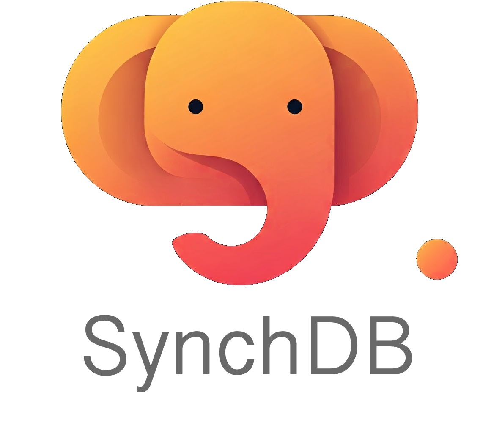

# 关于

## **关于 SynchDB**

SynchDB 是一个 PostgreSQL 扩展，支持从异构数据库（例如 MySQL、SQL Server 和 Oracle）直接快速可靠地复制到 PostgreSQL。与传统的数据管道不同，SynchDB 在 PostgreSQL 内部原生处理整个同步和数据转换过程，无需任何中间件或外部编排工具。它主要管理以下端到端任务：

* 建立并维护与外部数据库的连接
* 从源系统捕获变更事件
* 将这些事件转换为与 PostgreSQL 兼容的格式
* 将它们应用于 PostgreSQL

SynchDB 的核心集成了 Debezium 嵌入式引擎，这是一个基于 Java 的强大变更数据捕获 (CDC) 库，支持多种数据库连接器。 SynchDB 使用 Java 原生接口 (JNI) 连接 PostgreSQL 基于 C 语言的运行时和 Debezium 的 Java 环境，从而实现两者之间的无缝协作。

这种架构使 PostgreSQL 能够充分利用 Debezium 丰富的连接器生态系统，同时保持扩展的轻量级、灵活性和易于部署。

🔗 了解更多关于 Debezium 的信息，请点击此处 (https://debezium.io/documentation/reference/stable/index.html)。

## **主要特性**

- 高效的数据同步
- 支持从 MySQL、SQL Server 和 Oracle 数据库复制
- 灵活的数据转换规则，包括表名、列名、数据类型和自定义数据转换表达式
- 轻松与现有 PostgreSQL 数据库集成
- 初始快照和变更数据捕获 (CDC) 模式
- 支持 DDL 和 DML 逻辑复制
- 全局连接器状态、错误和统计信息配置

## **支持的 PostgreSQL 版本**

- PostgreSQL：16、17、18
- IvorySQL：4、5

## **支持的源数据库**

- MySQL：8.0.x、8.2
- SQL Server：2017、2019、2022
- Oracle：12c、19c、21c、23ai
- Openlog Replicator：1.3.0 ~ 1.8.5

## **所需的第三方库**

- Java Runtime Environment（JRE）17 或更高版本
- libprotobuf-c v1.5.2（如果需要 Openlog Replicator 支持）

## **版本历史**

- [SynchDB v1.3](https://github.com/Hornetlabs/synchdb/releases/tag/v1.3)
- [SynchDB v1.2](https://github.com/Hornetlabs/synchdb/releases/tag/v1.2)
- [SynchDB v1.1](https://github.com/Hornetlabs/synchdb/releases/tag/v1.1)
- [SynchDB v1.0](https://github.com/Hornetlabs/synchdb/releases/tag/v1.0)
- [SynchDB v1.0 Beta1](https://github.com/Hornetlabs/synchdb/releases/tag/v1.0_beta1)

## **快速入门**

开始使用 SynchDB 的最快方法是使用预编译的 Docker 镜像以及源数据库系统（MySQL、SQL Server、Oracle 等）的配套镜像，所有这些镜像均由源存储库中的 `ezdeploy.sh` 工具驱动。此交互式工具可以启动 SynchDB、一个或多个源数据库，以及可选的 Prometheus + Grafana 用于监控，非常适合进行快速的端到端测试。请参阅 [快速入门指南](getting-started/quick_start/)。

其他实用链接：

* [SynchDB 架构决策](architecture/architecture/)
* [安装指南](getting-started/installation/)
* [源数据库设置](getting-started/remote_database_setups/)